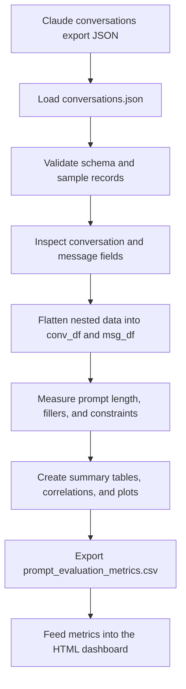
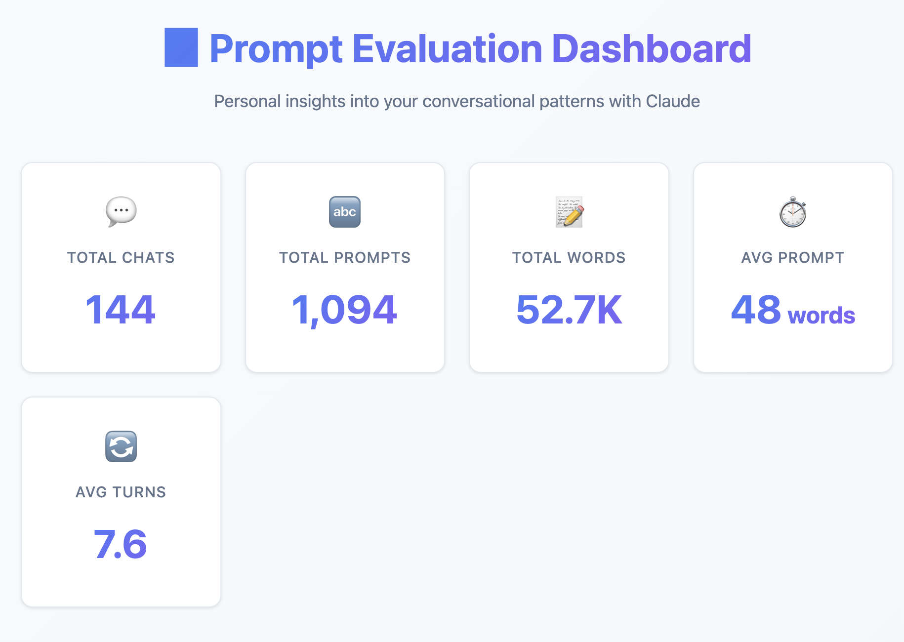
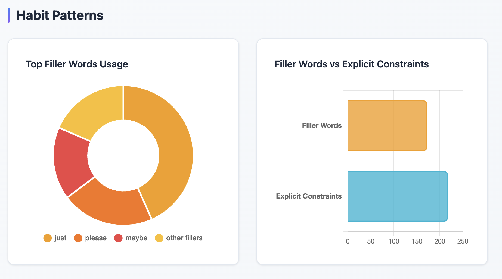

# Prompt Dashboard

This repository turns exported conversation logs into an interactive HTML dashboard so I can study how I prompt, how often I use filler words, and how I structure constraints across chats.

## What It Does

The main script takes a JSON export from Claude and builds a dashboard with:

- summary cards for chats, prompts, words, and averages
- filler-word and constraint habit charts
- a sortable table of the 10 longest conversations

The script is useful when you want to inspect the prompts you have been typing, spot repeated habits, and compare different conversation styles over time.

## How the Notebook Works

This notebook is the path I used to transform the raw export into a dashboard-ready dataset. It starts with the Claude JSON export, checks the structure, flattens the nested conversations, and then turns those rows into the metrics used by the dashboard.



In other words:

1. Load the export.
2. Inspect the structure.
3. Flatten the nested data.
4. Calculate prompt metrics.
5. Reuse the results for the dashboard.

## Screenshot





## Usage

Run the generator with a JSON file as input:

```bash
python3 generate_dashboard.py /path/to/conversations.json
```

You can also provide a custom output file:

```bash
python3 generate_dashboard.py /path/to/conversations.json /path/to/output.html
```

Example using the Claude export in this repo:

```bash
python3 generate_dashboard.py claude/data-*/conversations.json
```

## Project Direction

This is part of a larger personal data-analysis project. The broader goal is to collect and analyze data from the services I already use, learn patterns in how I work and prompt, and eventually use those exports for feature extraction and possibly ML-based analysis or training workflows.

Future integrations will extend the same idea to:

- Gemini logs
- ChatGPT logs

## Repository Structure

- `generate_dashboard.py` - CLI script that reads a JSON export and creates the dashboard
- `main.py` - thin launcher for the script
- `prompt_evaluation_metrics.csv` - derived metrics export used during exploration
- `eda_claude.ipynb` - exploratory notebook that informed the script


